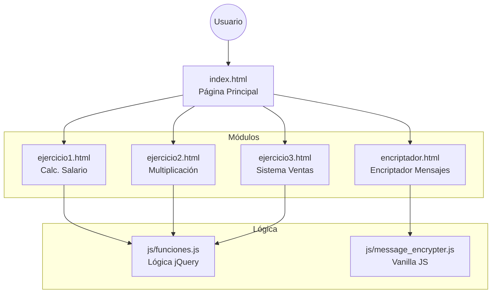

# Colección de Proyectos JavaScript


> Una colección integral de aplicaciones web interactivas que demuestran la implementación de lógica de negocio, manipulación del DOM y diseño responsivo.

<div align="center">

[🔗 Ver Código en GitHub](https://github.com/dariverap/proyectosJavascript)

[🇺🇸 English Version](./README.md)

</div>

---

## 👨‍💻 Introducción y Autor

Este repositorio sirve como un portafolio de proyectos de desarrollo web fundamentales e intermedios. Muestra la capacidad para implementar lógica de negocios (cálculos de salarios, procesamiento de ventas) y desafíos algorítmicos (encriptación/desencriptación) utilizando tecnologías web estándar. La interfaz está construida con **Bootstrap 4** para asegurar la adaptabilidad móvil (responsiveness) y estilizada con CSS personalizado.

**Creado por Diego Rivera**

---

## 🏗 Arquitectura del Proyecto

El proyecto está estructurado como una colección de páginas HTML estáticas que sirven como puntos de entrada para diferentes módulos lógicos, compartiendo recursos comunes de estilo y scripts.

### Estructura de Archivos

```bash
.
├── estilos/                  # Recursos de estilo
│   ├── estilo.css            # Estilos personalizados de layout y componentes
│   ├── reset.css             # Reinicio de CSS para consistencia entre navegadores
│   └── style.css             # Estilos específicos para el módulo Encriptador
├── js/                       # Lógica de la aplicación
│   ├── funciones.js          # Lógica para Ejercicios 1, 2 y 3 (jQuery)
│   └── message_encrypter.js  # Lógica para el Encriptador de Texto (Vanilla JS)
├── ejercicio1.html           # Módulo: Calculadora de Salarios
├── ejercicio2.html           # Módulo: Tablas de Multiplicar
├── ejercicio3.html           # Módulo: Sistema de Ventas de Helados
├── encriptador.html          # Módulo: Encriptador Desafío Alura
├── index.html                # Página Principal / Hub del Portafolio
└── README.es.md              # Documentación del Proyecto
```

### Flujo Lógico



---

## 🛠 Stack Tecnológico

*   **Núcleo:** HTML5, CSS3, JavaScript (ES6+)
*   **Librerías:** 
    *   **jQuery 3.6.0**: Utilizado para la manipulación del DOM y manejo de eventos en los ejercicios.
    *   **Bootstrap 4.6.1**: Utilizado para el sistema de grillas responsivo, navegación y componentes de UI.
    *   **Font Awesome**: Utilizado para la iconografía.
*   **Herramientas:** Google Fonts (familia tipográfica Inter).

---

## 🧩 Descripción de Módulos

### 1. Encriptador de Mensajes (`encriptador.html`)
Una herramienta de transformación de texto segura basada en las especificaciones del Desafío Alura.
*   **Lógica:** Reemplaza vocales con llaves de cadena específicas (`e` -> `enter`, `i` -> `imes`, etc.).
*   **Características:** Validación de entrada (solo minúsculas), Copiar al portapapeles, Diseño responsivo.

### 2. Calculadora de Salarios (`ejercicio1.html`)
Calcula los salarios de empleados basándose en tarifas por hora.
*   **Lógica:** Aplica tarifa doble para las horas extra (mayores a 40 horas).

### 3. Generador de Tablas de Multiplicar (`ejercicio2.html`)
Genera tablas matemáticas dinámicamente.
*   **Lógica:** Bucles anidados para generar tablas hasta el número especificado por el usuario.

### 4. Sistema de Ventas (`ejercicio3.html`)
Una simulación de Punto de Venta (POS) para una heladería.
*   **Lógica:** Calcula totales basados en precios unitarios y cantidades, aplicando un descuento del 5% si el total excede 250.

---

## 🚀 Instalación y Uso

Dado que este proyecto consta de archivos estáticos, no se requiere proceso de compilación ni gestor de paquetes (npm/yarn).

1.  **Clonar el repositorio:**
    ```bash
    git clone https://github.com/dariverap/proyectosJavascript.git
    ```

2.  **Navegar al directorio del proyecto:**
    ```bash
    cd proyectosJavascript
    ```

3.  **Ejecutar la aplicación:**
    *   Simplemente abre el archivo `index.html` en tu navegador web preferido.
    *   *Opcional:* Usa un servidor ligero como la extensión "Live Server" de VS Code para una mejor experiencia.

---

© 2022 Diego Rivera. Todos los derechos reservados.
