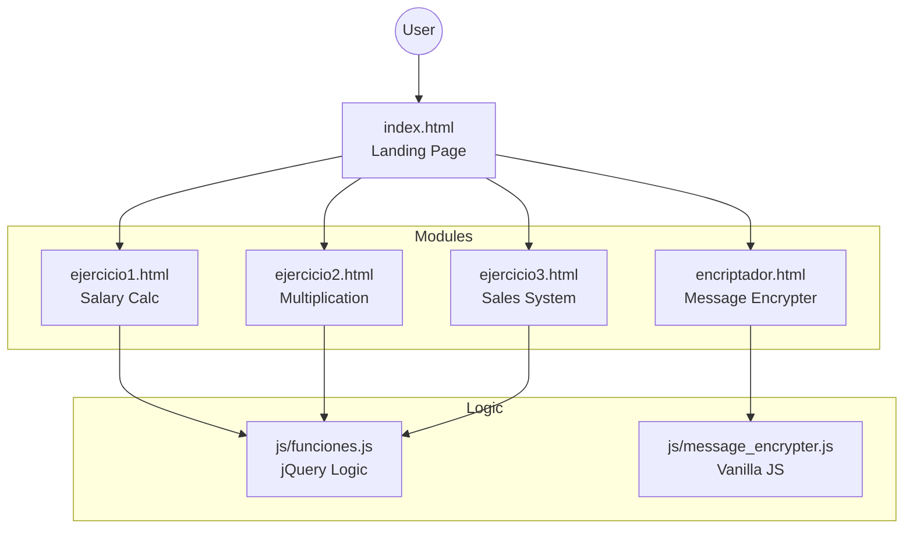

# JavaScript Projects Portfolio


> A comprehensive collection of interactive web applications demonstrating logic implementation, DOM manipulation, and responsive design.

<div align="center">

[🔗 View Code on GitHub](https://github.com/dariverap/proyectosJavascript)

[🇪🇸 Versión en Español](./README.es.md)

</div>

---

## 👨‍💻 Introduction & Author

This repository serves as a portfolio of foundational and intermediate web development projects. It showcases the ability to implement business logic (salary calculations, sales processing) and algorithmic challenges (encryption/decryption) using standard web technologies. The interface is built with **Bootstrap 4** for responsiveness and styled with custom CSS for unique branding.

**Created by Diego Rivera**

---

## 🏗 Project Architecture

The project is structured as a collection of static HTML pages serving as entry points for different logical modules, sharing common style and script resources.

### File Structure

```bash
.
├── estilos/                  # Styling resources
│   ├── estilo.css            # Custom layout and component styles
│   ├── reset.css             # CSS Reset for cross-browser consistency
│   └── style.css             # Specific styles for the Encrypter module
├── js/                       # Application Logic
│   ├── funciones.js          # Logic for Exercises 1, 2, and 3 (jQuery)
│   └── message_encrypter.js  # Logic for the Text Encrypter (Vanilla JS)
├── ejercicio1.html           # Module: Salary Calculator
├── ejercicio2.html           # Module: Multiplication Tables
├── ejercicio3.html           # Module: Ice Cream Sales System
├── encriptador.html          # Module: Alura Challenge Encrypter
├── index.html                # Main Landing Page / Portfolio Hub
└── README.md                 # Project Documentation
```

### Logical Flow



---

## 🛠 Tech Stack

*   **Core:** HTML5, CSS3, JavaScript (ES6+)
*   **Libraries:** 
    *   **jQuery 3.6.0**: Used for DOM manipulation and event handling in the exercises.
    *   **Bootstrap 4.6.1**: Used for the responsive grid system, navigation, and UI components.
    *   **Font Awesome**: Used for iconography.
*   **Tools:** Google Fonts (Inter font family).

---

## 🧩 Modules Overview

### 1. Message Encrypter (`encriptador.html`)
A secure text transformation tool based on the Alura Challenge specifications.
*   **Logic:** Replaces vowels with specific string keys (`e` -> `enter`, `i` -> `imes`, etc.).
*   **Features:** Input validation (lowercase only), Copy to clipboard, Responsive design.

### 2. Salary Calculator (`ejercicio1.html`)
Calculates employee wages based on hourly rates.
*   **Logic:** Applies double rate for overtime hours (>40 hours).

### 3. Multiplication Table Generator (`ejercicio2.html`)
Generates mathematical tables dynamically.
*   **Logic:** Nested loops to generate tables up to the user-specified number.

### 4. Sales System (`ejercicio3.html`)
A Point of Sale (POS) simulation for an ice cream shop.
*   **Logic:** Calculates totals based on unit prices and quantities, applying a 5% discount if the total exceeds 250.

---

## 🚀 Installation & Usage

Since this project consists of static files, no build process or package manager (npm/yarn) is required.

1.  **Clone the repository:**
    ```bash
    git clone https://github.com/dariverap/proyectosJavascript.git
    ```

2.  **Navigate to the project directory:**
    ```bash
    cd proyectosJavascript
    ```

3.  **Run the application:**
    *   Simply open `index.html` in your preferred web browser.
    *   *Optional:* Use a lightweight server like VS Code "Live Server" extension for a better experience.

---

© 2022 Diego Rivera. All rights reserved.
